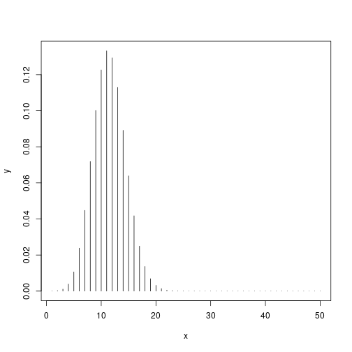

The Binomial Distribution
========================================================
author: Math 145
date:
autosize: false
width:1920
height:1080

Building on the last example... 
===
Suppose I have a 23% chance of making a free throw, and I make 50 shots.

* What is $P(\text{Exactly no baskets})$?
* What is $P(\text{Make all the baskets})$
* *How* would you figure out $P(\text{exactly 23 baskets})$?
* *How* would you figure out $P(\text{exactly } n \text{ baskets})$?

Binomial distribution
===
If we have a categorical variable (make basket vs don't make basket) we can get numbers - namely counts or proportions.

These numbers belong to *sets*, not *individuals*.

The binomial distribution gives us a distribution of these counts/proportions, provided some assumptions are met.

What would a probability distribution of the free throws look like?

Conditions
===
* Trials are independent
* Fixed number of trials, $n$
* Trials can be considered success or failure^*
* Fixed probability of success, $p$


If this is true, and $X$ is the number of "successes" in $n$ trials:
* we say $X$ is distributed Binomially
* and write $X \sim Bin(n,p)$ or $X \sim B(n,p)$

Examples?
===
incremental:true

* X is the proportion of people in a random sample in favor of stem cell research.
* X is the number of people in favor of stem cell research in a random sample of 500 people.
* X is the number of failures in 4 dental implants, if each one has a 5% probability of failing.
* X is the number of bad apples in a delivery from a farm
* X is the average glucose level in the blood of a random sample of 50 people
* X is the number of accidents on a stretch of road in 24 hours.
* X is the number of cases of flu in a family of 4 in a winter

R Code
===
R can calculate these probabilities:


```r
dbinom(1,3,.5)
```

```
[1] 0.375
```

(There are other binom command too)

A Plot
===
What does this plot tell us?


```r
x <- 1:50
y <- dbinom(x, 50, .23)
plot(y~x, type="h")
```



Sickle Cell Anemia
===
Sickle cell anemia is a disease in which the blood produces abnormal hemoglobin. Some people are carriers of the disease and produce both normal and abnormal hemoglobin. They are generally healthy, but if two carriers have a child, the child has a 25% probability of having the disease. Assume siblings having the disease are independent events.

Suppose both parents are carriers.

Will the distribution of the number of children with sickle cell anemia in a family with 2 children be Binomially distributed?

Graph the probability distribution.

Making things more complicated
===
What about that question on the free throws - 
Suppose I have a 23% chance of making a free throw, and I make 50 shots.

What are the chances I make exactly 12 of them?

https://youtu.be/kHgXBhhAuZ4?t=2m38s

Where does that leave us?
===

$$P(X=k) = \binom{n}{k} p^k (1-p)^{n-k} = \frac{n!}{k!(n-k)!} p^k (1-p)^{n-k}$$

More about the distribution
===
incremental:true

* Mean:
  * $\mu = np$
* Variance:
  * $\sigma^2 = np(1-p)$
* Standard deviation
  * $\sigma = \sqrt{np(1-p)}$

More questions
===
What are the chances I make *at least* 12 shots? Or fewer than 10 shots?

This seems hard. But we can go back to R for this.

R Code
===

`pbinom(q,n,prob)` is the probability of *at most* `q` successes out of `n`, with probability of success `prob`


```r
pbinom(1,2,.5)
```

```
[1] 0.75
```

Show by hand why this is 0.75.

Then verify by hand:


```r
pbinom(1,30,0.1)
```

```
[1] 0.183695
```


Last "by hand" calculation
===

I have a 10\% change of making a free throw. If I take 27 shots, what is the probability I make at least one of them?
