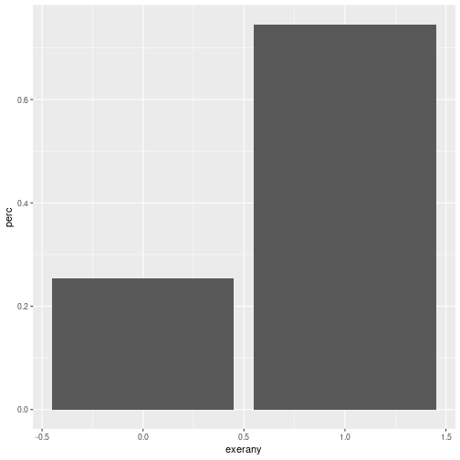
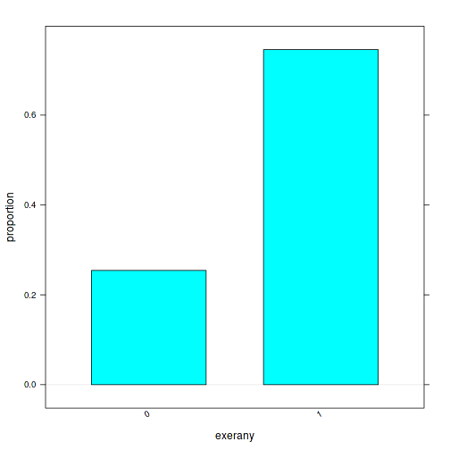
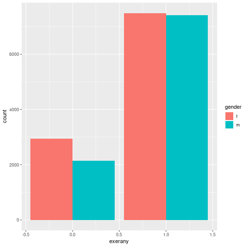
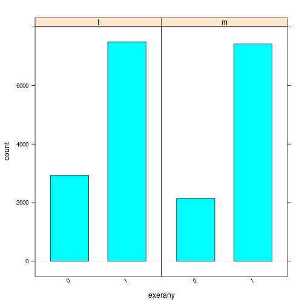
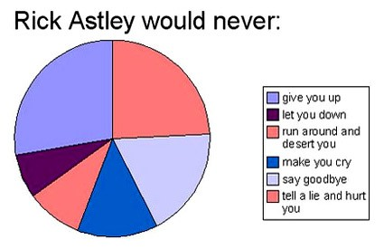

Categorical Data
========================================================
author: 
date: 
autosize: false
width: 1920
height: 1080


Reminder
===
What is categorical data?

A Question
===
In January 1971, the Gallup poll asked: "A proposal has been made in Congress to require the U.S. government to bring home all U.S. troops before the end of the this year. Would you like to have your congressman vote for or against this proposal?"

Guess the results, for respondents in each education category, and fill out this table (the two numbers in each column should add up to 100%):

|                                            | Grade school education | High school education | College education | Total adults |
|--------------------------------------------|------------------------|-----------------------|-------------------|--------------|
| % for withdrawal of U.S. troops (doves)     |                        |                       |                   | 73%          |
| % against withdrawal of U.S. troops (hawks) |                        |                       |                   | 27%          |
| Total                                      | 100%                   | 100%                  | 100%              | 100%         |


True values
===
|                                            | Grade school education | High school education | College education | Total adults |
|--------------------------------------------|------------------------|-----------------------|-------------------|--------------|
| % for withdrawal of U.S. troops (doves)     |  80%                   | 75%                   |  60%              | 73%          |
| % against withdrawal of U.S. troops (hawks) |  20%                   | 25%                   |  40%              | 27%          |
| Total                                      | 100%                   | 100%                  | 100%              | 100%         |


Frequency tables
===

```r
tally(exerany~hlthplan, data=cdc)
```

```
       hlthplan
exerany     0     1
      0   851  4235
      1  1673 13241
```

Contingency Tables
===

```r
tally(exerany~hlthplan, data=cdc, format="count")
```

```
       hlthplan
exerany     0     1
      0   851  4235
      1  1673 13241
```

```r
tally(exerany~hlthplan, data=cdc, format="percent")
```

```
       hlthplan
exerany        0        1
      0 33.71632 24.23323
      1 66.28368 75.76677
```

```r
tally(exerany~hlthplan, data=cdc, format="count", margins=TRUE)
```

```
       hlthplan
exerany     0     1
  0       851  4235
  1      1673 13241
  Total  2524 17476
```

More tables
===

```r
tally(exerany~hlthplan, data=cdc, format="count", margins=FALSE)
```

```
       hlthplan
exerany     0     1
      0   851  4235
      1  1673 13241
```

```r
tally(exerany~hlthplan, data=cdc, format="percent", margins=TRUE)
```

```
       hlthplan
exerany         0         1
  0      33.71632  24.23323
  1      66.28368  75.76677
  Total 100.00000 100.00000
```
(Can look at either row or column proportions)

Bar Graphs
===

```r
bargraph(~exerany, data=cdc)
```


***

```r
bargraph(~exerany, data=cdc, type="proportion")
```



More Bar Graphs
===

```r
bargraph(~exerany, group=gender, data=cdc)
```


***

```r
bargraph(~exerany|gender, data=cdc)
```



Pie Graphs
===


Don't be fooled by pie graphs!
===


