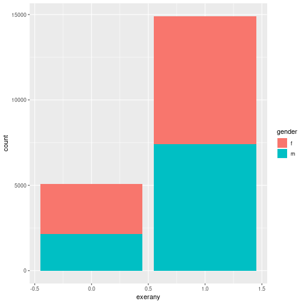

Categorical Data
========================================================
author: 
date: 
autosize: false
width: 1920
height: 1080


Reminder
===
What is categorical data?

A Question
===
In January 1971, the Gallup poll asked: "A proposal has been made in Congress to require the U.S. government to bring home all U.S. troops before the end of the this year. Would you like to have your congressman vote for or against this proposal?"

Guess the results, for respondents in each education category, and fill out this table (the two numbers in each column should add up to 100%):

|                                            | Grade school education | High school education | College education | Total adults |
|--------------------------------------------|------------------------|-----------------------|-------------------|--------------|
| % for withdrawal of U.S. troops (doves)     |                        |                       |                   | 73%          |
| % against withdrawal of U.S. troops (hawks) |                        |                       |                   | 27%          |
| Total                                      | 100%                   | 100%                  | 100%              | 100%         |


True values
===
|                                            | Grade school education | High school education | College education | Total adults |
|--------------------------------------------|------------------------|-----------------------|-------------------|--------------|
| % for withdrawal of U.S. troops (doves)     |  80%                   | 75%                   |  60%              | 73%          |
| % against withdrawal of U.S. troops (hawks) |  20%                   | 25%                   |  40%              | 27%          |
| Total                                      | 100%                   | 100%                  | 100%              | 100%         |

In the news
===

[WSJ](https://www.washingtonpost.com/opinions/a-chilling-study-shows-how-hostile-college-students-are-toward-free-speech/2017/09/18/cbb1a234-9ca8-11e7-9083-fbfddf6804c2_story.html?tid=ss_mail&utm_term=.ffb92c79fd85)

Frequency tables
===

```r
cdc %>% 
  group_by(exerany, hlthplan) %>% 
  count()
```

```
# A tibble: 4 x 3
# Groups:   exerany, hlthplan [4]
  exerany hlthplan     n
    <int>    <int> <int>
1       0        0   851
2       0        1  4235
3       1        0  1673
4       1        1 13241
```

Big Frequency Tables
===

```r
cdc %>% 
  group_by(exerany, hlthplan, genhlth) %>% 
  count()
```

```
# A tibble: 20 x 4
# Groups:   exerany, hlthplan, genhlth [20]
   exerany hlthplan genhlth       n
     <int>    <int> <fct>     <int>
 1       0        0 excellent   118
 2       0        0 fair        173
 3       0        0 good        333
 4       0        0 poor         55
 5       0        0 very good   172
 6       0        1 excellent   644
 7       0        1 fair        684
 8       0        1 good       1398
 9       0        1 poor        329
10       0        1 very good  1180
11       1        0 excellent   341
12       1        0 fair        212
13       1        0 good        521
14       1        0 poor         44
15       1        0 very good   555
16       1        1 excellent  3554
17       1        1 fair        950
18       1        1 good       3423
19       1        1 poor        249
20       1        1 very good  5065
```


Contingency Tables
===
Counts vs percentages

(Can look at either row or column proportions)

Bar Graphs
===


Bar Graphs
===

```r
cdc %>% 
  ggplot(aes(x = exerany))+
  geom_bar()
```


***

```r
cdc %>% 
  group_by(exerany) %>% 
  count() %>% 
  ungroup() %>% 
  mutate(perc = n/sum(n)) %>% 
  ggplot(aes(x = exerany, y = perc))+
  geom_bar(stat= "identity")
```


More Bar Graphs
===

```r
cdc %>% 
  ggplot(aes(x = exerany, fill=gender))+
  geom_bar()
```


***

```r
cdc %>% 
  ggplot(aes(x = exerany, fill=gender))+
  geom_bar(position= "dodge")
```


Pie Graphs
===


Don't be fooled by pie graphs!
===


