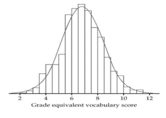

## A question

https://fivethirtyeight.com/features/the-20-most-extreme-cases-of-the-book-was-better-than-the-movie/

## Distributions

* What is a distribution?
* What does it tell you?

## Density Curves
The histogram shows the actual vocabulary scores of a group of 7-th grade children.

The smooth curve is the idealized curve what we imagine we would get if we took the population of all such children and made the bin widths very small. The smooth curve is called a *density curve*.

What do you notice?

## Features

* Symmetric
* Bunched around a central value
* Mean is around 7
* Standard deviation? Maybe 2?

## Differences between continuous and discrete distributions
* Discrete/categorical distribtions convey information by the *heights* of the bars
* Continuous distributions convey information using the *areas* under the curve

## The Normal Distribution

Mean: 68.2 inches
SD: 2.7 inches

How would the shape of this distribution change if we changed the mean or the standard deviation?

## What might be normal?
> * Income in a city?
> * Scores on a standardized test?
> * Age of IC students?

## Rules of thumb
IF you have a normal distribution:

* ~68% of the data lies within 1 sd of the mean
* ~95% of the data lies within 2 std of the mean
* ~99.7% of the data lies within 3 std of the mean

## Example
Women’s heights are normally distributed with mean 65 inches (165 cm) and standard deviation 2.5 inches (6.4 cm)

* What proportion of women are less than 60 inches? (5ft)
* What proportion of women are less than 70 inches?
* Approiximately what proportion is more than 72 inches? (6ft)
* What if we want to know a different number? More than 63 inches?

## Z-Scores
https://fivethirtyeight.com/features/the-20-most-extreme-cases-of-the-book-was-better-than-the-movie/

$$z = \dfrac{Value - Mean}{Standard \ deviation} = \dfrac{\bar{x} - \mu}{\sigma}$$

Mean of z-scores is 0, SD of z-scores is 1

## Using z-scores
On the 2008 SAT, which of the following scores represents the best performance: 580 on reading, 595 on math, or 575 on writing?

      | Reading | Math | Writing
------|---------|------|--------
Mean  | 501     | 515  | 493
SD    | 112     | 116  | 111

## Using z-scores
Reading z = 0.71
Math z = 0.69
Writing z = 0.74

## Finding proportions from z-scores
Many methods, we'll use tables

> * Find the proportion of data that has z-score less than 0.7
> * Find the proportion with z-score above 1.2
> * Find the proportion with z-scores between -0.20 and 1.4
> * What z-score is at the 70th percentile?
> * What z-score has 75% of the data above it?
> * What percentile is a SAT reading score of 700? (Mean reading score is 503; standard deviation is 113)
> * What SAT math score is at the 90th percentile? (Mean math score is 518; standard deviation is 115)

## Binomial distribution