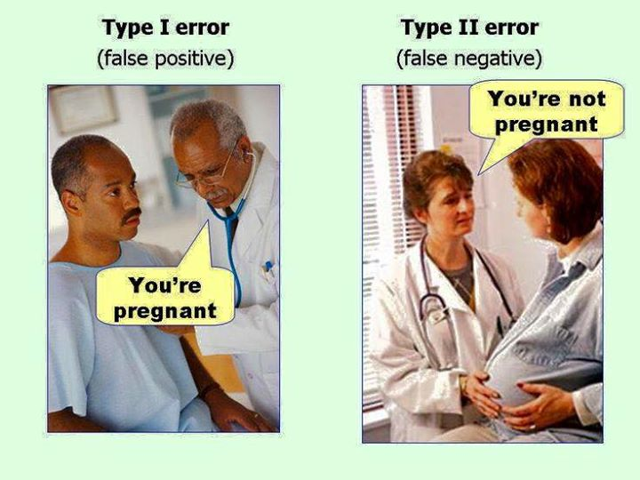
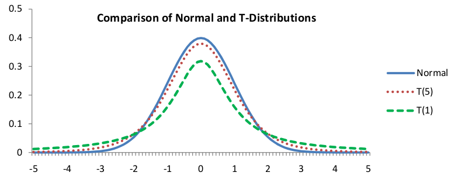

## Hypothesis Tests for Means: Using Z-Values

- Inference: Making decisions from samples
- We have made estimates using *confidence intervals*
- Now we will do *hypothesis testing* (we have kind of already done this)
- This lets us make yes/no decisions

## Testing a Malaria Vaccine
Malaria, carried by mosquitoes, kills about 1 million people a year, many of them children under
five. Ninety percent of the cases occur in Africa. There is currently no vaccine against malaria, only preventative drugs, such as quinine, which must be taken continuously to work. Malaria cannot be
cured; people who have the disease face recurrences throughout their lives.

In 2004, experiments were done in Mozambique, Africa, on a new drug. The drug does not prevent malaria, but it does seem to reduce the severity of the disease. The experiment measured the effect of the drug on:

- The number of children who were infected
- The length of time until infection

## Gas Mileage
A gasoline additive claims to increase the average mileage of a certain type of car from the usual 24 miles per gallon, with standard deviation 2.3 miles per gallon. A store owner wants to test this claim, and if there is convincing evidence that the mean is greater than 24, he will stock this additive. He finds that the mean mileage of a sample of 45 cars using the additive is 24.7 miles per gallon. Using a significance level of 0.05, decide whether the store should the store stock this additive.

## Hypothesis Testing
* Always testing against the null hypothesis

* 

## Errors
* We are always taking a chance of making an error. What is the $\alpha$-level telling us?
* Type I error is incorrectly rejecting a true null hypothesis (a "false positive")
* Type II error is failing to reject a false null hypothesis (a "false negative")
* What would this look like in our examples?

---

## A Fix
We've made a big assumption in our hypothesis tests. Consider the last two examples - what about these are realistic and what is not?

---

* When we don't know $\sigma$
* CLT says SE is $\dfrac{\sigma}{\sqrt{n}}$
* If we don't know $\sigma$, we can use $s$, but then we need to change our distirbution

* Remember, CLT says:
\ $z = \dfrac{\bar{x}-\mu}{\sigma/\sqrt{n}} \sim N(0,1)$

## The T-Distribution

* If we replace $\sigma$ with $s$, what does the new distribution look like?
* 

## Degrees of Freedom

* The T-distributions is similar to normal, but has thicker tails, since there is more variability in T than in Z because $s$ is variable, whereas $\sigma$ was not.
* For large sample sizes, the T-distribution is approximately equal to the standard normal. For $n>100$, you can use $Z$ instead of $T$.
* We can use a new table to calculate t scores
$$t = \dfrac{\bar{x}-\mu}{s/\sqrt{n}} \sim T(n-1)$$
* Why $n-1$?

## SAT scores
A coaching service claims to raise SAT scores. Scores are normally distributed with mean of 475. If a random sample of 40 students who are coached has mean score 500 with standard deviation 90,
a) Find a 95% confidence interval for the mean of all coached students.
b) Decide if the mean of the coached group is significantly different than the mean (that is, different than 475)?

* Why do we need to use the t-distribution?
* How does using a CI differ from using a hypothesis test here?
* How do we get a p-value?
    * Either we use a computer, or we don't (citical t)

## An Issue with the 1-Tail vs 2-Tail Tests

Can we conclude a direction from a 2 tailed test?

