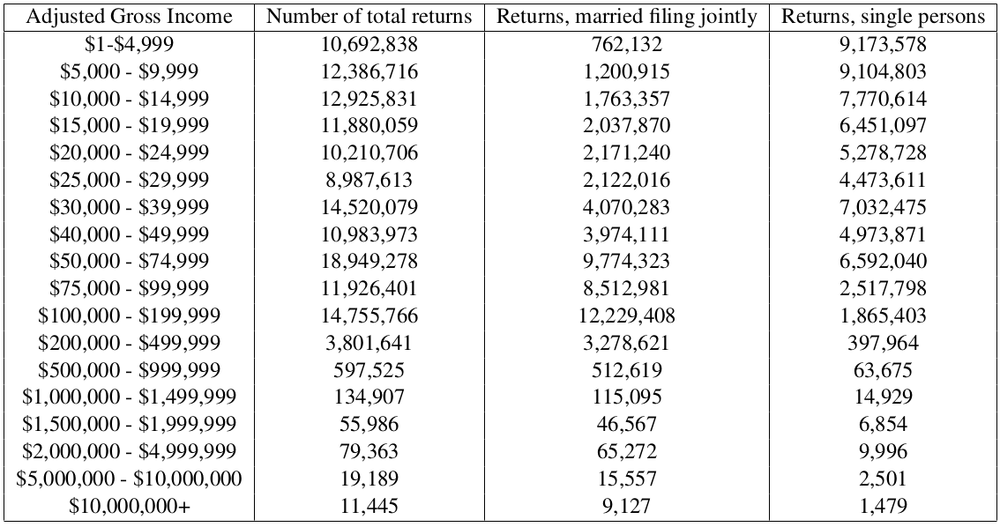
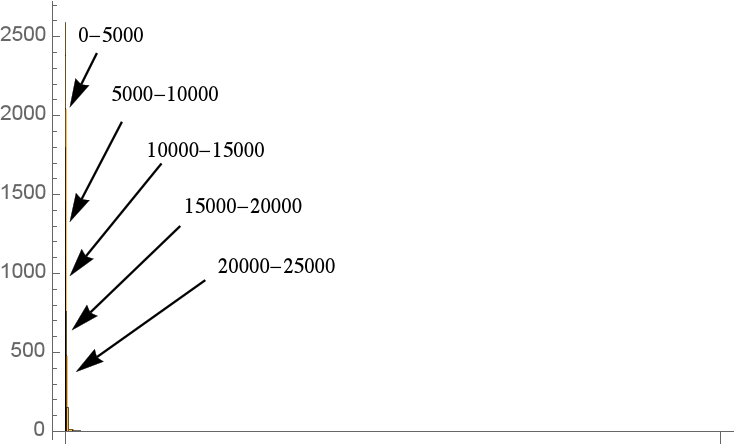
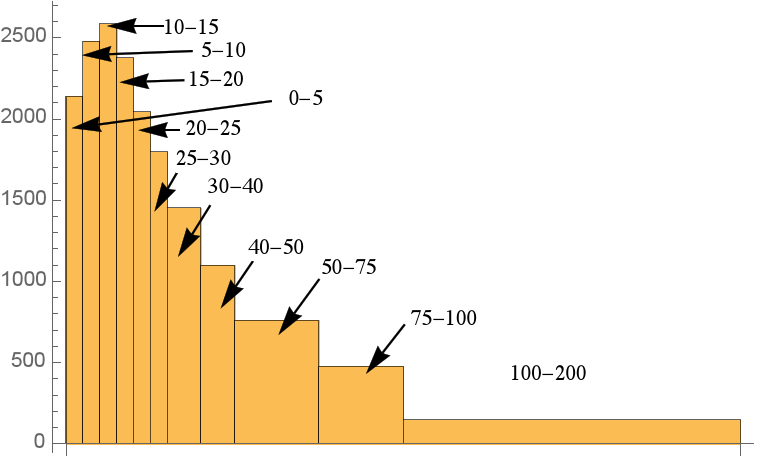
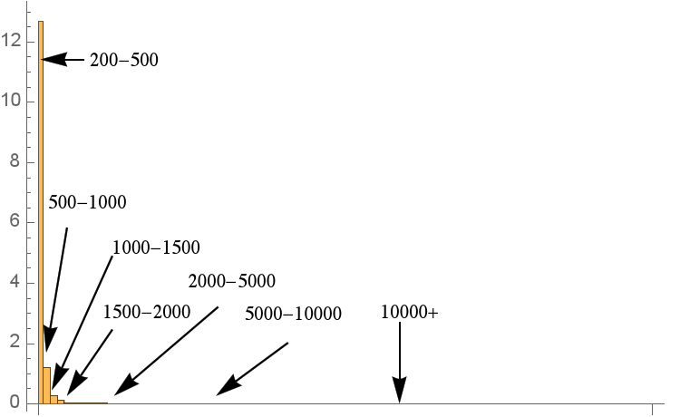
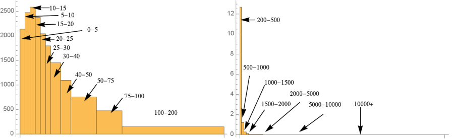

## Thinking about income

* What income distribution is "fair"?
* Sketch a histogram that represents what you believe to be the income distribution in the United States
* Include your guesses for the mean and median income

## Fair Income
* Sketch a second histogram representing what you think *should* be the income distribution in the United States
* Include the mean and median income, and describe the shape, center, and spread of this histogram
* Give justification for what you think income distribution should look like

## Data
* What data would help us understand the situation?
* What limitations might we have in obtaining this information?

## Let's look at the data!

* How might we want to represent this data?

---

## Low

## High

## Together

* Notice that the bin corresponding to the greatest incomes does not have an upper limit.
* What might we choose as an upper limit? How could we justify this?

## Analyzing the data
* Estimate the mean and median incomes. How do they compare, and why?
* What assumptions did you need to make to estimate the mean and median?
* Are these reasonable assumptions?

## Interpreting
* What do these histograms tell us about income inequality in the U. S.?
* What surprises you about income inequality in the U. S.?
* How do we deal with the uppermost income bin being unbounded?
* How does using the lower, midpoint, or upper points of each bin interval affect the mean and
median incomes?
* How does data presented in bins affect our calculating the mean and median of the data?
    * Does it make histograms easier/ harder to create?
    * What, if anything, do we gain (and what do we lose) from the presentation of data in this form versus the raw data?
    * Who gets to choose the bin sizes?

## Interpreting
* Median U. S. household income is $51324 [12], and mean U. S. household income is $70909.
    * Why might these be higher than the AGI data that we have?
    * What might we hypothesize about the income distribution of households? (more skewed, less skewed, and why)
    
---

[politizane video](http://www.youtube.com/watch?v=QPKKQnijnsM)
