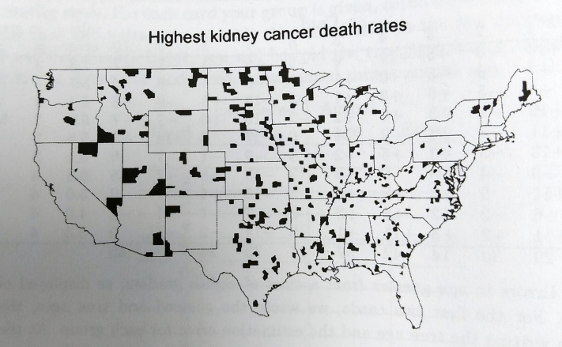
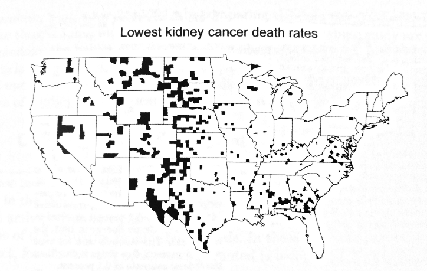
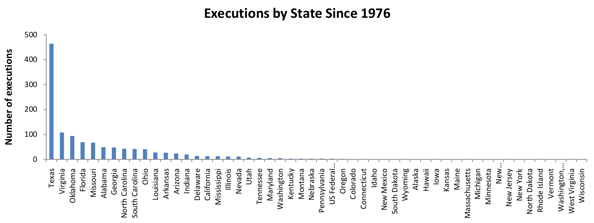

## Introductions
- Find a stranger
    - Name
    - Major
    - An interest
    - Something they're good at
    
## Teams
Introduce your new friend to a new pair of neighbors

## Logistics
- Sakai
- Slides
- Textbook
- R

## Where do we start?
* What is Statistics?
* What does is mean when you hear that there is a 20% chance of rain?

## Kidney Cancer Rates

---

---

## Coke and pepsi

* The great debate - design an experiment! What questions could we answer?
* How could we analyze our experiment? What would be good enough?
* Reading: How a tea party...

## A Typical State
Look at the number of death penalty cases - what is typical?

## Handedness

## Collecting data