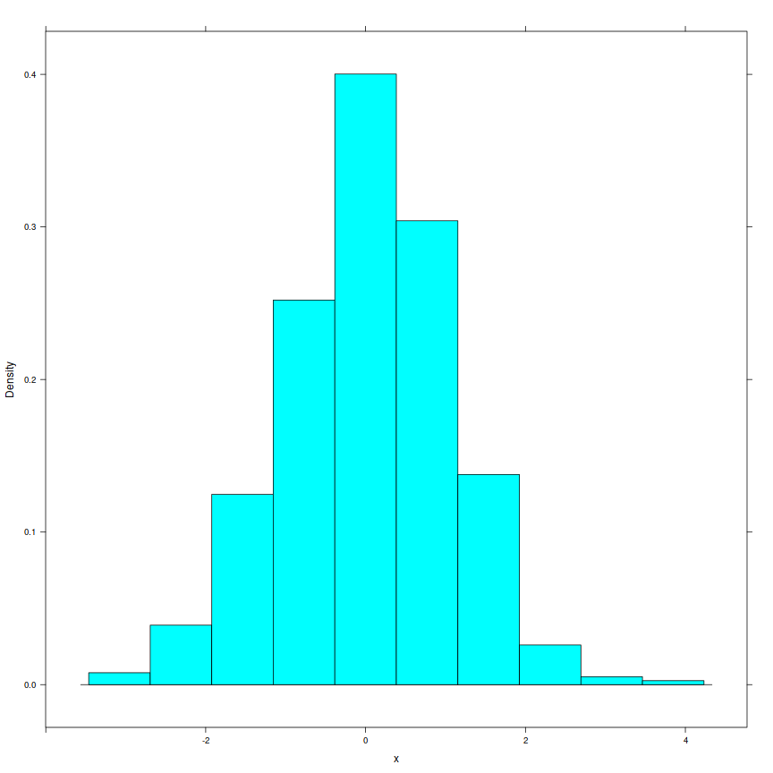
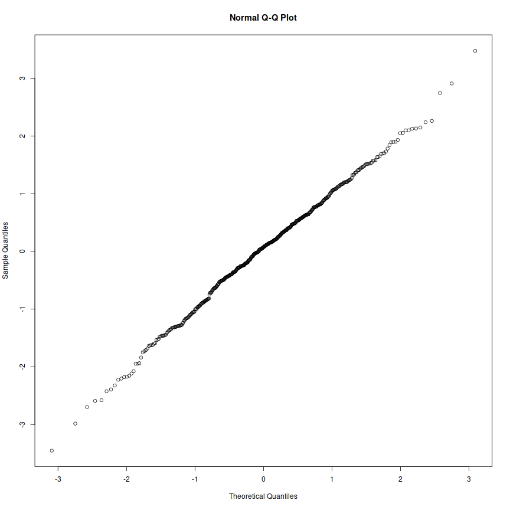
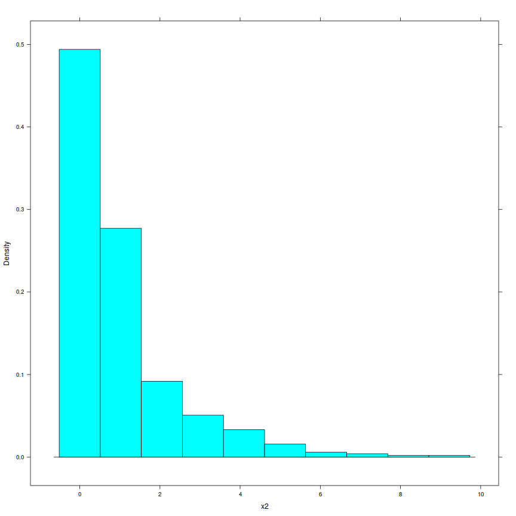
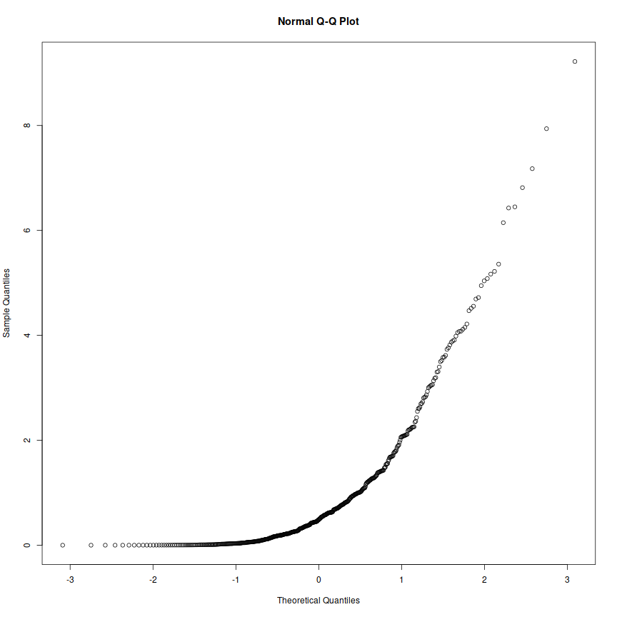

The Normal Distribution
========================================================
author: Math 145
date: 
autosize: true

Distributions
===
* What is a distribution?
* What does it tell you?

Density Curves
===
incremental:true

The histogram shows the actual vocabulary scores of a group of 7-th grade children.

<center>

</center>

What do you notice?

* The smooth curve is the idealized curve what we imagine we would get if we took the population of all such children and made the bin widths very small.
* The smooth curve is called a *density curve*.

Features
===
<center>

</center>

* Symmetric
* Bunched around a central value
* Mean is around 7
* Standard deviation? Maybe 2?

Differences between continuous and discrete distributions
===
* Discrete/categorical distribtions convey information by the *heights* of the bars
* Continuous distributions convey information using the *areas* under the curve

The Normal Distribution
===
<center>

</center>

Mean: 68.2 inches

SD: 2.7 inches

How would the shape of this distribution change if we changed the mean or the standard deviation?

What might be normal?
===
incremental:true

* Income in a city?
* Scores on a standardized test?
* Age of IC students?

Rules of thumb
===
IF you have a normal distribution:

* ~68% of the data lies within 1 sd of the mean
* ~95% of the data lies within 2 std of the mean
* ~99.7% of the data lies within 3 std of the mean

Z-Scores
===

https://fivethirtyeight.com/features/the-20-most-extreme-cases-of-the-book-was-better-than-the-movie/

$$z = \dfrac{Value - Mean}{Standard \ deviation} = \dfrac{\bar{x} - \mu}{\sigma}$$

* Mean of z-scores is 0
* SD of z-scores is 1


Example
===
Women’s heights are normally distributed with mean 65 inches (165 cm) and standard deviation 2.5 inches (6.4 cm)

* What proportion of women are less than 60 inches? (5ft)
* What proportion of women are less than 70 inches?
* Approiximately what proportion is more than 72 inches? (6ft)
* What if we want to know a different number? More than 63 inches?

We can use a table or we can use R

Using z-scores
===
On the 2008 SAT, which of the following scores represents the best performance: 580 on reading, 595 on math, or 575 on writing?

Subject | Reading | Math | Writing
--------|---------|------|--------
Mean    | 501     | 515  | 493
SD      | 112     | 116  | 111

Using z-scores
===
Reading z = 0.71
Math z = 0.69
Writing z = 0.74

Finding proportions from z-scores
===
incremental:true

Many methods, we'll use tables first:

* Find the proportion of data that has z-score less than 0.7
* Find the proportion with z-score above 1.2
* Find the proportion with z-scores between -0.20 and 1.4
* What z-score is at the 70th percentile?
* What z-score has 75% of the data above it?
* What percentile is a SAT reading score of 700? (Mean reading score is 503; standard deviation is 113)
* What SAT math score is at the 90th percentile? (Mean math score is 518; standard deviation is 115)

Using R
===
Subject | Reading | Math | Writing
--------|---------|------|--------
Mean    | 501     | 515  | 493
SD      | 112     | 116  | 111

* What percent of reading scores are less than 450?

```r
pnorm(450,501,112)
```

```
[1] 0.3244262
```

***

* What percent of z-scores are above 2?

```r
pnorm(2,0,1, lower.tail=FALSE)
```

```
[1] 0.02275013
```

or use:

```r
pnorm(2,0,1)
```

```
[1] 0.9772499
```

===
What z-score is at the 70th percentile?

```r
qnorm(.70,0,1)
```

```
[1] 0.5244005
```

***

What SAT math score would be at the 81st percentile?

Subject | Reading | Math | Writing
--------|---------|------|--------
Mean    | 501     | 515  | 493
SD      | 112     | 116  | 111


```r
qnorm(.81,515,116)
```

```
[1] 616.836
```


Analyzing normality
===


```r
x <- rnorm(500)
histogram(~x)
```



---


```r
qqnorm(x)
```




Analyzing normality
===

```r
x <- rnorm(500)
x2 <- x^2
histogram(~x2)
```



---


```r
qqnorm(x2)
```



===


```r
data("ChickWeight")
head(ChickWeight)
```

```
Grouped Data: weight ~ Time | Chick
  weight Time Chick Diet
1     42    0     1    1
2     51    2     1    1
3     59    4     1    1
4     64    6     1    1
5     76    8     1    1
6     93   10     1    1
```

```r
dim(ChickWeight)
```

```
[1] 578   4
```

===


```r
summary(ChickWeight)
```

```
     weight           Time           Chick     Diet   
 Min.   : 35.0   Min.   : 0.00   13     : 12   1:220  
 1st Qu.: 63.0   1st Qu.: 4.00   9      : 12   2:120  
 Median :103.0   Median :10.00   20     : 12   3:120  
 Mean   :121.8   Mean   :10.72   10     : 12   4:118  
 3rd Qu.:163.8   3rd Qu.:16.00   17     : 12          
 Max.   :373.0   Max.   :21.00   19     : 12          
                                 (Other):506          
```

```r
favstats(~weight, data=ChickWeight)
```

```
 min Q1 median     Q3 max     mean       sd   n missing
  35 63    103 163.75 373 121.8183 71.07196 578       0
```

===


```r
histogram(~weight, data=ChickWeight)
```


***


```r
qqnorm(ChickWeight$weight)
```


