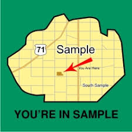
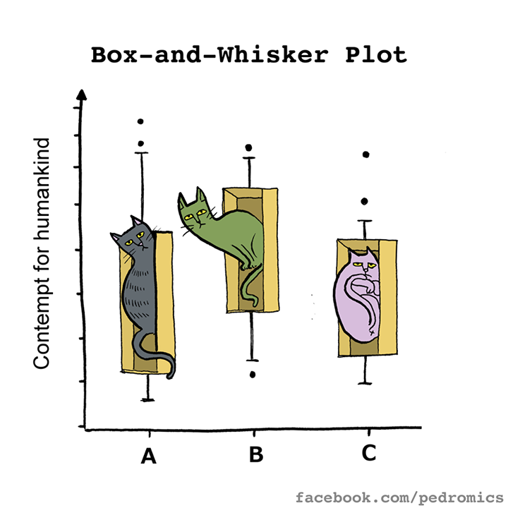

Numerical Data
========================================================
author: Math 145
date: 
autosize: false
width: 1920
height: 1080


===


Reproducible research
===
incremental:true

* Motivation for software like R
* What if your data changes?
* What if you need to change a graph?
* *What if someone else wants to verify your results?*


Reminder
===
What's a numerical variable?

What are the types?

Measures of Center
===
type:section

Means
===
How do we compute it?

For what kind of data?

Mean formula
===
$$\bar{x} = \dfrac{x_1+x_2+x_3+\ldots+x_n}{n}$$

- $\bar{x}$ vs $\mu$




Compared to...
===
Median - What does is measure?

Mode - What does it measure?

(What if there are an even number of numbers?)

Example
===
Data set: 1, 2, 9, 20, 5

Mean? Median? SD?

Why is the mean larger than the median?

CDC
===

```r
favstats(~height, data=cdc)
```

```
 min Q1 median Q3 max    mean       sd     n missing
  48 64     67 70  93 67.1829 4.125954 20000       0
```

What are Q1 and Q3?

Why the choices?
===
Why do you think we might have different "measures of center"?

Measures of Spread
===
type:section

Measuring the spread of data: Standard deviation vs IQR
===
incremental:true
How are each computed?

Let's build the formula for standard deviation...

SD: Why do we take the square root?

$\sigma$ vs $s$

Why denominator of $n-1$? (it's complicated)

Outliers
===
Rules for Medians/IQR: 1.5 * IQR

Sensitivity
===
incremental:true
Which of the statistics are sensitive vs robust?

How can we tell?

In the # of death penalty cases, what happens if Texas is removed?

Graphing
===
type:section

1 Variable: Histograms
===

```r
histogram(~height, data=cdc)
```


***

We can change the number of break, the number of bins, etc., but we typically won't worry too much about those.

On a histogram...
===

```r
histogram(~height, data=cdc)
```


***
* Mean is a balance point
* Median has half the data on either side
* SD is the "average distance from the mean"

Skew
===
What does skew measure?

Box and whisker plots
===


Boxplots
===
Tell us:

* median
* Q1
* Q3
* min
* max
* outliers (if there are any)

***



CDC: Age
===

```r
favstats(~age, data=cdc)
```

```
 min Q1 median Q3 max     mean       sd     n missing
  18 31     43 57  99 45.06825 17.19269 20000       0
```


```r
bwplot(~age, data=cdc)
```


CDC: Height
===

```r
favstats(~height, data=cdc)
```

```
 min Q1 median Q3 max    mean       sd     n missing
  48 64     67 70  93 67.1829 4.125954 20000       0
```


```r
bwplot(~height, data=cdc)
```


Dotplots
===

```r
dotPlot(~age, data=cdc)
```


Notation
===
* Sample mean: $\bar{x}$
* Population mean: $\mu$
* Sample proportion: $\hat{p}$
* Population proportion: $p$

2 Variables: Scatterplots
===
How do we use explanatory vs response variables? (When relevant)

CDC
===

```r
head(cdc)
```

```
    genhlth exerany hlthplan smoke100 height weight wtdesire age gender
1      good       0        1        0     70    175      175  77      m
2      good       0        1        1     64    125      115  33      f
3      good       1        1        1     60    105      105  49      f
4      good       1        1        0     66    132      124  42      f
5 very good       0        1        0     61    150      130  55      f
6 very good       1        1        0     64    114      114  55      f
```

Scatterplot
===

```r
xyplot(wtdesire~weight, data=cdc)
```


***
What does the scatterplot tell us? What does the scatterplot not tell us?

