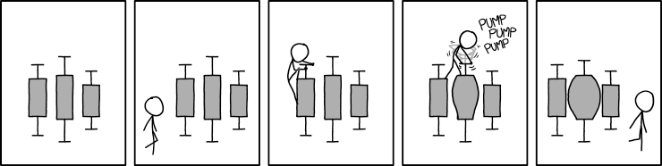

```{r setup, include=FALSE}
knitr::opts_chunk$set(echo = TRUE, warning = FALSE, message=FALSE)
require(tidyverse)
cdc <- read.csv("./cdc.csv")
```

##


## Reproducible research

> * Motivation for software like R
> * What if your data changes?
> * What if you need to change a graph?
> * *What if someone else wants to verify your results?*


## Reminder

What's a numerical variable?

What are the types?

# Measures of Center

## Means

How do we compute it?

For what kind of data?

## Mean formula

$$\bar{x} = \dfrac{x_1+x_2+x_3+\ldots+x_n}{n}$$

- $\bar{x}$ vs $\mu$

<center>

</center>

## Compared to...

Median - What does is measure?

Mode - What does it measure?

(What if there are an even number of numbers?)

## Example

Data set: 1, 2, 9, 20, 5

Mean? Median? SD?

Why is the mean larger than the median?

## CDC

```{r}
cdc %>% 
  summarize(avg.height = mean(height), sd.height = sd(height), median.height = median(height))
```

## CDC more data....

What are Q1 and Q3?

```{r}
cdc %>% 
  summary()
```

## Why the choices?

Why do you think we might have different "measures of center"?

# Measures of Spread

## Measuring the spread of data: Standard deviation vs IQR

> * How are each computed?
> * Let's build the formula for standard deviation...
> * SD: Why do we take the square root?
> * $\sigma$ vs $s$
> * Why denominator of $n-1$? (it's complicated)

## Outliers

Rules for Medians/IQR: 1.5 * IQR

## Sensitivity

> * Which of the statistics are sensitive vs robust?
> * How can we tell?
> * In the # of death penalty cases, what happens if Texas is removed?

# Graphing

## 1 Variable: Histograms

```{r}
cdc %>% 
  ggplot(aes(height))+
  geom_histogram()
```

We can change the number of break, the number of bins, etc., but we typically won't worry too much about those.

## On a histogram... {.columns-2}

```{r echo=FALSE, out.width=300}
cdc %>% 
  ggplot(aes(height))+
  geom_histogram()
```

* Mean is a balance point
* Median has half the data on either side
* SD is the "average distance from the mean"

## Skew

What does skew measure?

## Box and whisker plots



## Boxplots

Tell us:

* median
* Q1
* Q3
* min
* max
* outliers (if there are any)

***


## CDC: Age

```{r}
cdc %>% 
  summary()
```

***

```{r}
cdc %>% 
  summarize(mean.age = mean(age), median.age = median(age), sd.age = sd(age), IQR.age = IQR(age))
```

## Boxplot

```{r, out.width=700}
cdc %>% 
  ggplot(aes(y = age))+
  geom_boxplot()
```


## CDC: Height

```{r}
cdc %>% 
  summary()
```

## Height Boxplot

```{r}
cdc %>% 
  ggplot(aes(y = height))+
  geom_boxplot()
```

## Notation

* Sample mean: $\bar{x}$
* Population mean: $\mu$
* Sample proportion: $\hat{p}$
* Population proportion: $p$

## 2 Variables: Scatterplots

How do we use explanatory vs response variables? (When relevant)

## CDC

```{r}
head(cdc)
```

## Scatterplot

```{r}
cdc %>% 
  ggplot(aes(x = weight, y = wtdesire))+
  geom_point()
```

## Scatterplot {.columns-2}

```{r out.width=300, echo=FALSE}
cdc %>% 
  ggplot(aes(x = weight, y = wtdesire))+
  geom_point()
```

What does the scatterplot tell us?

What does the scatterplot not tell us?

