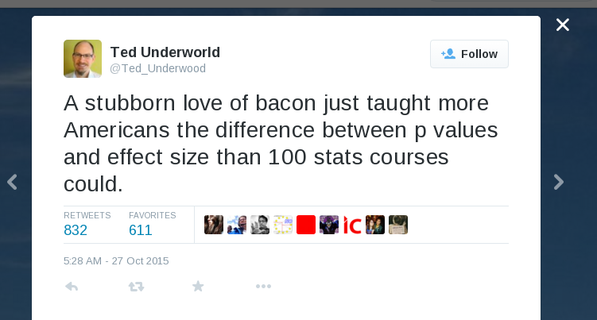

Proportions
========================================================
author: Math 145

How do we deal with proportions?
========================================================
incremental: true
* When might we be interested in estimating proportions?
* Comes from a count of a categorical variable
* Research red meat and cancer for Friday

Effect size
===

Red meat
===
"We know that, out of every 1000 people in the UK, about 61 will develop bowel cancer at some point in their lives. Those who eat the lowest amount of processed meat are likely to have a lower lifetime risk than the rest of the population (about 56 cases per 1000 low meat-eaters)."

Casey Dunlop, Cancer Research UK

"Processed meat and cancer – what you need to know" http://scienceblog.cancerresearchuk.org/2015/10/26/processed-meat-and-cancer-what-you-need-to-know/

About the classification scheme:
http://www.theatlantic.com/health/archive/2015/10/why-is-the-world-health-organization-so-bad-at-communicating-cancer-risk/412468/

What does this "link" mean?
===
"As Professor Phillips explains, “IARC does ‘hazard identification’, not ‘risk assessment’.

"That sounds quite technical, but what it means is that IARC isn’t in the business of telling us how potent something is in causing cancer – only whether it does so or not"", he says.

===

To take an analogy, think of banana skins. They definitely can cause accidents, explains Phillips, but in practice this doesn’t happen very often (unless you work in a banana factory). And the sort of harm you can come to from slipping on a banana skin isn’t generally as severe as, say, being in a car accident.

But under a hazard identification system like IARC’s, ‘banana skins’ and ‘cars’ would come under the same category – they both definitely do cause accidents."

http://scienceblog.cancerresearchuk.org/2015/10/26/processed-meat-and-cancer-what-you-need-to-know/

Notation
===

            | Population parameter | Sample statistic
------------|----------------------|-----------------
Size        | N                    | n
Mean        | $\mu$                | $\bar{x}$
SD          | $\sigma$             | $s$
Proportion  | $p$                  | $\hat{p}$

Estimating p
===
incremental:true
What question might we want to answer about processed meat eaters? PPSS?

Confidence interval

Hypothesis test

===

            | Population parameter | Sample statistic
------------|----------------------|-----------------
Size        | N                    | n
Mean        | $\mu$                | $\bar{x}$
SD          | $\sigma$             | $s$
Proportion  | $p$                  | $\hat{p}$

What do we know? What do we need?

Let's take a step back...
===
Let's try constructing CIs where we *know* the answer

Experiment with cards
===
* Draw 8 cards from the deck and record their suits

* Return them to the deck

* Pass the deck to the next person

The point estimate
===
What is your point estimate,  $\hat{p}$, for the true proportion of hearts in the deck, $p$?

What does the sampling distribution look like?
===
incremental: true
* How is $\hat{p}$ distributed?
* How do we define $\hat{p}$ if we know the count of successes, $X$ and the number of trials, $n$?
* Is $\hat{p}$ binomially distributed?

What are the features of the sampling distribution?
===
incremental: true
$E(\hat{p})$?

$$E(\hat{p}) = E\left(\dfrac{X}{n}\right) = \dfrac{E(X)}{n} = \dfrac{np}{n} = p$$

What are the features of the sampling distribution?
===
incremental:true

$Var(\hat{p})$?

$$Var(\hat{p}) = Var\left(\dfrac{X}{n}\right) = \dfrac{Var(X)}{n^2} = $$
$$\dfrac{np(1-p)}{n^2} = \dfrac{p(1-p)}{n}$$

$SD(\hat{p}) = \sqrt{\dfrac{p(1-p)}{n}}$

Central Limit Theorem for Proportions
===
incremental:true
* Distribution of $\hat{p}$ is approximately **normal**
* Mean is population parameter, $p$
* SD is $\sqrt{\dfrac{p(1-p)}{n}}$, called the standard error

Assumptions for normality:
===
incremental:true
* Samples are independent
* Expect at least 10 successes and 10 failures (success-failure condition)
  * How do we check this?

Making a confidence interval
===
Do we know enough to make a confidence interval now?

What to do about p
===
incremental:true
Two approaches:
* Use $\hat{p}$ (typically done when constructing CIs)
* Use the null value, e.g. 0.5 (typically done when doing hypothesis tests)

Estimating the Margin of Error with $p=0.5$:
Using 0.5 instead of gives an estimate for the margin of error which is slightly too large, but usually
very close. This has several advantages:
* The margin of error can be estimated before the sample is taken
* The same margin of error can be used for several questions derived from the same sample.
* It’s a "safe" estimate because it is at least as large as the real one.

Making the Confidence Interval
===
incremental:true
Do we now have enough information to construct a CI?

Construct an 80% CI for the proportion of hearts in the deck

Back to processed meat
===
incremental:true
"We know that, out of every 1000 people in the UK, about 61 will develop bowel cancer at some point in their lives. Those who eat the lowest amount of processed meat are likely to have a lower lifetime risk than the rest of the population (about 56 cases per 1000 low meat-eaters)."

Suppose this came from sampling 1,000 people "who eat the lowest amount of processed meat" - could we say that people in this category are less likely to develop bowel cancer than the rest of the population?

Would your answer change if the sample was 10,000 people? 100,000 people? How many people would need to have been surveyed to say the low-processed meat eaters have a lower rate of bowel cancer than the rest of the population?

Testing
===
CLT for proportions lets us find CIs and do hypothesis tests, just like for means

Example: Testing the Malaria Vaccine
===
Now looking at the proportion of people infected (instead of time to infection)

Without the drug, the rate of severe malaria infection in the area of the study was 34.9 children
per 1000. Of 745 children given the drug, 11 got severe malaria during the course of the study. Does
this data suggest that the drug reduces the rate of severe malaria infections?

Should we use a $t$ or $z$ distribution?

Confidence intervals
===
$$\left(\hat{p}-z^*\sqrt{\dfrac{p(1-p)}{n}}, \ \hat{p}+z^*\sqrt{\dfrac{p(1-p)}{n}}\right)$$

Without the drug, the rate of severe malaria infection in the area of the study was 34.9 children
per 1000. Of 745 children given the drug, 11 got severe malaria during the course of the study. Does
this data suggest that the drug reduces the rate of severe malaria infections?

Example
===
incremental:true
In 2003, a February 24-26 CNN poll of 1004 Americans found that 59% supported sending
troops to Iraq.

Find a 90% confidence interval for the proportion of Americans who supported
sending troops to Iraq.

Find the margin of error for a 95% confidence interval.

What sample size gives a margin of error of 1% for a 95% confidence interval? (Same data, try both ways)

** Notice: using $\ p=0.5$ gives the most conservative estimate

Continued
===
A reporter stated 2/3 population were in favor of sending troops to Iraq. Does this poll (59% in a
sample of 1004) provide support for this assertion? (Use a 10% significance level and a
confidence interval.)

Use a hypothesis test to analyze.

Two samples?
===

Population | Population proportion | Sample size | Sample count | Sample proportion
-----------|-----------------------|-------------|--------------|-------------------
1          | $p_1$                 | $n_1$       | $X_1$        | $\hat{p}_1=X_1/n_1$
2          | $p_2$                 | $n_2$       | $X_2$        | $\hat{p}_2=X_2/n_2$

What can we measure?
===
Difference between proportions: $D=\hat{p}_1-\hat{p}_2$

By the central limit theorem
===
incremental:true
* D is approximately normal
* Mean is $\mu_D = \mu_{\hat{p}_1-\hat{p}_2} = p_1-p_2$
* Sine the samples are independent, the variances add: $\sigma^2_D=\sigma_{\hat{p}_1}^2+\sigma_{\hat{p}_2}^2 = \frac{p_1(1-p_1)}{n_1}+\frac{p_2(1-p_2)}{n_2}$
* SD is given by $\sigma_D = \sqrt{\frac{p_1(1-p_1)}{n_1}+\frac{p_2(1-p_2)}{n_2}}$

What if we don't know $\hat{p_1}$ or $\hat{p}_2$?

Confidence intervals
===
incremental:true
$$(\hat{p}_1-\hat{p}_2-M.E.,\hat{p}_1-\hat{p}_2+M.E.)$$

$$ME = z^*\times SE_D$$

$$(\hat{p}_1-\hat{p}_2-z^*\times SE_D,\hat{p}_1-\hat{p}_2+z^*\times SE_D)$$

Hypothesis test
===
incremental:true

Null hypothesis?

$H_0: p_1 = p_2$ or $H_0: p_1-p_2=0$

Test statistic?

$z$ or $t$?

$$z= \frac{sample - population}{SE}$$

$$z = \frac{(\hat{p}_1-\hat{p}_2)-(p_1-p_2)}{SE_D}$$

Example
===
incremental:true
In a 1998 Study at Columbia University called the “Back to School Teen Survey”, 1000 teenagers (12-17 years old) were interviewed. Of those 870 did not smoke; 130 did smoke. 68% of the non smokers got good grades (As & Bs) and 41% of the smokers got good grades.

* Find a 95% confidence interval for the difference in percentages of students who get good grades
in the two groups.
* Interpret the confidence interval.
* Use the confidence interval to decide if there is there a significant difference between the grades
of the smokers and the non-smokers. What significance level are you using?
* Can you conclude smoking lowers grades?

Malaria example, revisited
===
incremental:true
We tested whether the proposed malaria drug reduced the number of infections. We compared the infection rate with the drug—11 out of 745, a proportion of 0.0148—with a fixed infection rate of 0.0349. But in practice, we often do not know the baseline infection rate; that must be determined from a sample—the control group, which does not get the drug.

Of 745 children treated with the malaria drug, 11 got severe malaria. During the same period, 26
of the control group of 745 got sick. 1 Does this data suggest that the drug reduces the rate of severe
malaria infections?

How do you expect the results of this test to compare to the result of one-sample test?

Hypothesis test for 2-sample proportions
===
1. Null hypothesis, alternative hypothesis, significance level
2. Collect your data
3. Compute test statistic
4. Compute p-value
5. Make conclusion

A Caveat
===
incremental:true
In our null hypothesis, we assumed the proportions were equal - this should make our standard deviations equal as well.

This is called using a *shared proportion* or a *pooled proportion*.

Consider all data collected (both samples). What is $\ \hat{p}$?

If $\ \hat{p_1} = \hat{p_2} = \hat{p}$, what is the formula for $SE_D$?

Calculate the standard error of the difference in sample proportions using the shared proportion.

Calculate the z-score for the difference in sample proportions using the shared proportion for the
malaria example.

Testing HIV-AIDs Vaccines
===
In 2007, the drug company Merck tested a HIV-AIDs vaccine, the first of a new class of drugs. High
risk volunteers in the US and Latin America were randomly assigned the drug or a placebo. Both
groups were given safe sex counseling. After 13 months, 24 of the 741 people who received the
vaccine were infected, compared to 21 of the 762 people who received the placebo.

What conclusion can you draw from this data? Did the vaccine have a significant effect?

Another test
===
In September 2009, trials on another potential HIV vaccine, RV-144, given to volunteers in Thailand, reported the results in the diagram. 3 As before, all volunteers were given safe sex counseling.

Does this vaccine have a significant effect on infection rates?
