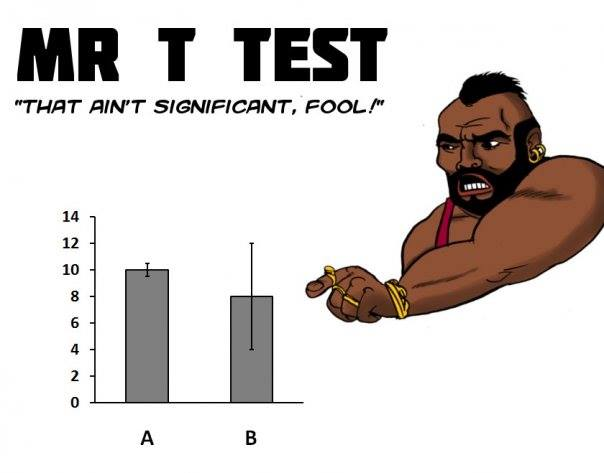

## 1 vs 2 Samples

* When testing a hypothesis, we ask whether the sample mean is significantly different from some
particular value—for example, if coached students had significantly higher SAT scores than the average.
* But how do we know that the coached students are like the rest of the population? Indeed, the
fact that they signed up for coaching suggests that they may be different.
* In practice, we often study a control group and compare two samples

## Matched Pairs

* Food on/off campus
    * http://theithacan.org/news/food-prices-found-higher-at-college-retail-than-off-campus-locations
* pre-test vs post-test
* Need two measures for each case
* Sample size of two groups must be identical

## Matched pairs: On vs off campus food
<!--Forty students who are coached have SAT scores where the mean gain is 9.3 and the
standard deviation of the gain is 8.1. Is the gain significant?
-->

* What would the data frame look like?
* PPSS?
* Hypotheses?
* df?
* $t^*$?
* $t$?

## Confidence Interval
<!--Find a 95% confidence interval for the mean increase in SAT score with coaching:

Forty students who are coached have SAT scores where the mean gain is 9.3 and the
standard deviation of the gain is 8.1.-->
Construct a CI for the previous problem. How do we interpret the confidence interval?

## Assumptions
Assumption for t-test matched pairs:

* Random variable in original population is normally distributed, so the difference is normal

## Usefulness
Matched pairs are useful because:

* Comparative studies enable us to avoid the avoid effects of confounding (for example,
choosing to get coaching with an increase in SAT scores—the students who chose coaching
may have been more likely to see an increase in scores anyway)
* Can be used even when randomization is not possible

## Limitation
What limitations might there be to a study like this?

* Students who choose to go for coaching may not represent the rest of the population, so we may not be able to generalize the results to other students.
    * In other words, coaching may not help other students in the same way.
* Better to compare increases in coached students’ scores with increases of other students’ scores; this is difference in differences.

## Without matched pairs...

* Suppose we want to compare the means of two groups, but:
    * No paring of individuals (not matched pairs)
    * Samples can be different sizes
* We will assume that
    * We want to compare means of two groups
    * Each group is a sample from a different population
    * Responses in each group are independent of those from other group

## What does a t-test do?

* 

## Example: Booking Flights
* https://hbr.org/2016/04/women-book-business-travel-earlier-saving-companies-millions
* How do you think this study was done?

## Notation

\           | Mean            | SD        | Size
------------|-----------------|-----------|-----
Population 1| $\mu_1$         | $\sigma_1$|
Population 2| $\mu_2$         | $\sigma_2$|
Sample 1    | $\bar{x}_1$     | $s_1$     | $n_1$
Sample 2    | $\bar{x}_2$     | $s_2$     | $n_2$

## Assumptions

Assumption for Two Sample Test:

* The two samples must be independent.

## Two-samples
Are the following two schools comparable in SAT scores?

School 1: A random sample of 43 students has mean SAT of 502, and standard deviation of 60

School 2: A random sample of 35 students has mean SAT of 480, and standard deviation of 50

What are we trying to estimate? PPSS?

## Standard error for two-sample t-test

* What is $Var(\bar{x}_1-\bar{x}_2)$?

* Remember: $Var(\bar{x}_1) = \frac{s_1^2}{n_1}$

* So $SE_{\bar{x}_1-\bar{x}_2} = \sqrt{\frac{s_1^2}{n_1}+\frac{s_2^2}{n_2}}$

## Performing the test
* Do we use a $z$ or a $t$?
* Degrees of freedom:
    * By hand: min($n_1-1,n_2-1$)
    * Computer: $\dfrac{\left( \dfrac{s_1^2}{n_1} + \dfrac{s_2^2}{n_2} \right)^2}{\dfrac{1}{n_1-1} \left( \dfrac{s_1^2}{n_1} \right)^2 + \dfrac{1}{n_2-1} \left( \dfrac{s_2^2}{n_2} \right)^2}$

## Is there a difference?

## Confidence interval for two sample means
Do we know the population standard deviation or not?
* What are we estimating?
* Do we use $t$ or $z$?
* Do we use $\sigma$ or $SE$?

If we know $\sigma$:
$(\bar{x}_1-\bar{x}_2-z \cdot \sigma_{\bar{x}_1-\bar{x}_2},\ \bar{x}_1-\bar{x}_2+z \cdot \sigma_{\bar{x}_1-\bar{x}_2})$

If we don't know $\sigma$:
$(\bar{x}_1-\bar{x}_2-t \cdot SE_{\bar{x}_1-\bar{x}_2},\ \bar{x}_1-\bar{x}_2+t \cdot SE_{\bar{x}_1-\bar{x}_2})$

where\ 
$SE_{\bar{x}_1-\bar{x}_2}=\sqrt{\frac{s_1^2}{n_1}+\frac{s_2^2}{n_2}}$ \ and\ 
$\sigma_{\bar{x}_1-\bar{x}_2}=\sqrt{\frac{\sigma_1^2}{n_1}+\frac{\sigma_2^2}{n_2}}$

<!--
## Back to the example
Find a 95% confidence interval for difference in population means for the two schools in
the previous example

What does this interval mean?

What does the CI tell us about the difference in population means? (Hint: Where is 0?)
-->