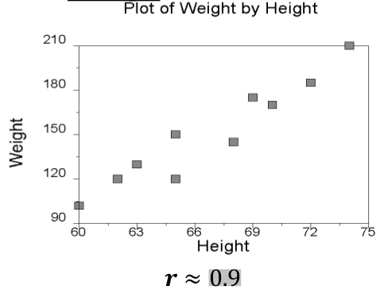
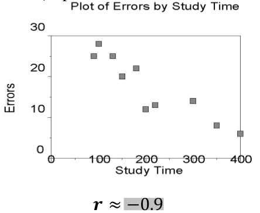
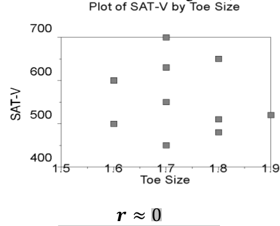
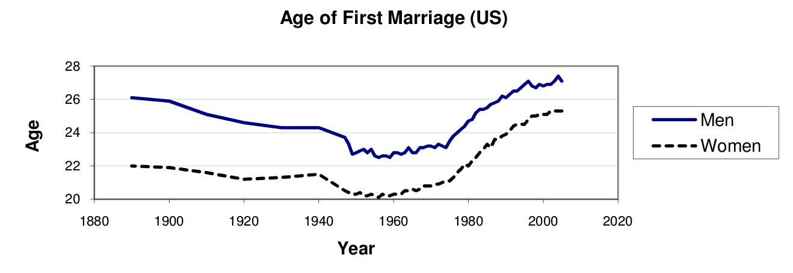
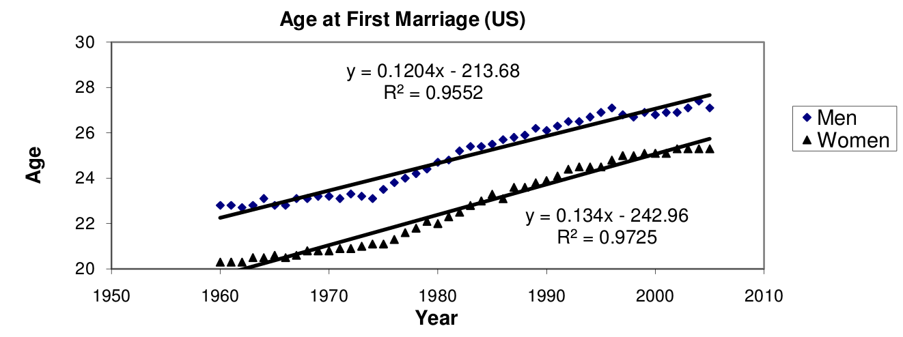
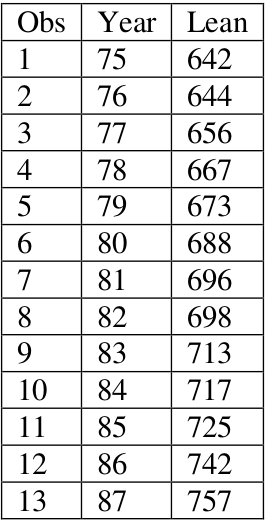
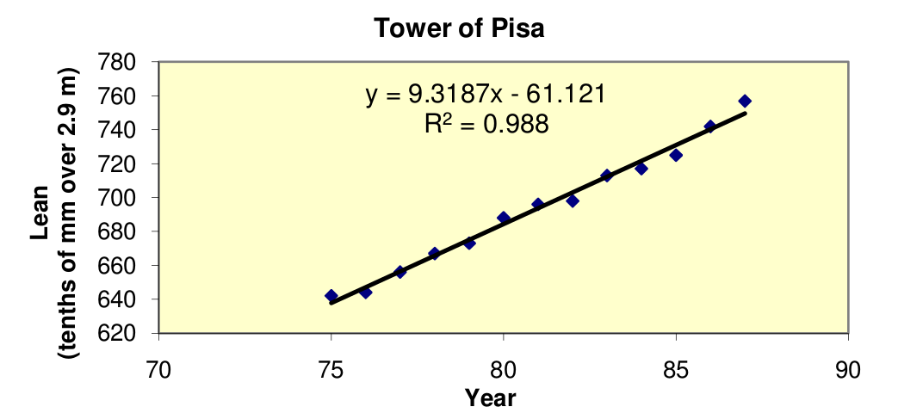

## Scatterplots

How do we analyze a pair of variables which are both numerical/continuous?

How could we investigate the relationship between height and armspan?

## Best fit line

How could we determine a best fit line for the data?

## Why find a best fit line

Extrapolation vs interpolation

## Correlation

To measure the strength of an association, we use the correlation coefficient, $r$.

$$r = \dfrac{1}{n-1}\displaystyle\sum_{i=1}^{i=n}\dfrac{x_i-\bar{x}}{s_x} \dfrac{y_i-\bar{y}}{s_y}$$

* What values can $r$ be?
* What does this value tell us?

## Examples

---

---

## The correlation coefficient

What does the correlation coefficient *mean*?

What if we have a flat line?

Parabolic?

## Residuals

Residuals are the errors for each term

What do these values look like graphically?

## Conditions for least squares line

* Linearity
* Nearly normal residuals
* Constant variability
* Independent observations

## What does the following abstract tell us?

The present study is based on the association of hand grip strength (both left and right) with height, weight and BMI
on randomly selected 600 normal healthy individuals(300 boys and 300 girls) aged 6-25 years of Amritsar, Punjab.
The findings of present study indicate a strong association of right and left hand grip strength with height ($r=0.925$ and $r=0.927$ respectively in boys and $r=0.800$ and $r=0.786$ respectively in girls), weight ($r=0.882$ and $r=0.878$ respectively in boys and $r=0.698$ and $r=0.690$ respectively in girls) and with BMI ($r=0.636$ and $r=0.632$ respectively in boys and $r=0.477$ and $r=0.472$ respectively in girls).

<small>From “An Association of Hand Grip Strength with Height, Weight and BMI in Boys and Girls aged 6-25 years of Amritsar, Punjab, India” Koley, Gandhi, Singh The Internet Journal of Biological Anthropology . 2008. Volume 2 Number 1.</small>

## Causation

What can we say about causation in the previous example?

## What is the trend in the age of marriage in the US?

---

Using the data from 1960-2005, we fit a line and use it to predict the age of marriage for men and women in 2010. In what year is the marriage age for men predicted to reach 30? Comment on the reliability of these answers.

* What do each of the numbers mean? What are the units?
* If the current trends continue, will men’s and women’s marriage ages ever be equal? If so, when?

## Leaning tower of Pisa

The Tower of Pisa is leaning more each year. The measurements show the lean in tenths of
millimeter beyond 2.9 meters. Thus in 1975, the Tower was leaning 2.9642 meter from the vertical.

1. Does it look like the lean of the Tower is increasing with time? If so, how fast is the lean increasing with time?
2. Is there evidence that the lean changes significantly with time?

## Regression line

Use the scatterplot and regression equation to describe how the lean changing with time.
Interpret the slope and vertical intercept.

## How can we decide if the lean is increasing significantly with time?

Do a hypothesis test. The regression equation was derived from a sample. It is a sample regression line.

The slope and intercepts in this sample regression equation are estimates, based on the particular sample we had. If we took another sample (for example, if we measured the tower at different times of year), we would probably get a different slope and a different intercept. They are *sample statistics*.

What we are really interested are the population parameters—that is, the slope and intercept of the line
that first the whole population, not just these sample values. This is the *population regression line*.

## Questions

Is it possible that the population regression equation has

* A different slope than the one we found, 9.32?
* A slope of different sign?
* A slope of 0?
    * It is certainly likely we’d get a different slope. The 9.32 is an estimate, and if we took a different sample, we’d expect to get a different slope.
    * Whether or not we’d get negative slope depends on whether the lean really is increasing.
* We’d like to know if the slope is significant different that 0.
    * We do a hypothesis test on the sample slope to find out.

## Hypothesis Test that the Slope of Population Regression Line is Significantly Different than 0

Null hypothesis: Slope of regression line is 0. This means that there is no relation between lean and year.

Alternate hypothesis: Slope of regression line is different from 0. There means there is a relationship
between lean and year.

$\alpha$ level = 0.05

Test statistic: Turns out to be a t-statistic, with $n-2$ degrees of freedom, where $n$ is the number of data
points.

$p$-value: ?

## How are the t-statistics and P-values for the slope calculated?

$$t=\dfrac{sample-population}{standard\ error}$$

For the slope:

$$t = \dfrac{9.31868132-0}{standard \ error}$$

How do we compute the standard error?

$$SE = \sqrt{\dfrac{\sum \epsilon_i^2}{n-2}}$$ (where $\epsilon_i = y_i - \hat{y}_i$)

## So we get

$$t = \dfrac{9.31868132-0}{0.3099142} = 30.06858$$

p-value is found using a computer to be $6.5 \times 10^{-12}$, which is very small, or use t-table

## Conclusion

The probability of seeing, by chance, a slope as different from 0 as we did if there was no
relationship between the lean and time is $6.5 \times 10^{-12}$. Thus, we reject the null the idea that there is no
relationship between lean and year; we conclude there is a *linear* relationship.

(Though this may not be the *best* model)

## Note

We will also be seeing a t-value, SE, and p-value for the intercept. What do you think this tells us, and why might we be interested in it?

## Why no r's reported?

Why do we keep seeing $R^2$?

## Important connections and notation

Sample regression line: $\hat{y} = b_0 + b_1 x$ (hat means estimated)

Population regression line: $\mu_y = \beta_0 + \beta_1 x$

$y_i = \beta_0 + \beta_1 x_i + \epsilon_i$

$b_1 = r \dfrac{s_y}{s_x}$

$b_0 = \bar{y}-b_1 \bar{x}$

Which are population parameters and which are sample statistics?